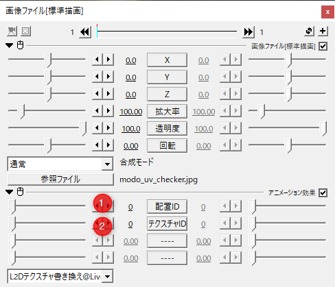
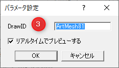

# アニメーション効果

## テクスチャ変更

画像オブジェクトに対して付与し、モデルのテクスチャを変更します。 
画像だけはなく動画などでも画像キャッシュを持つオブジェクトに対してあれば有効です。

|番号|要素名|説明|
|--|--|--|
|1|配置ID|パラメータを操作するモデルが配置されている番号を指定します|
|2|テクスチャID|テクスチャアトラス上のナンバーを指定します。|

## 位置追従

オブジェクトの配置を指定のArtMeshの平均頂点で上書きします。

|番号|要素名|説明|
|--|--|--|
|1|配置ID|パラメータを操作するモデルが配置されている番号を指定します|
|2|ArtMeshIndex|対象にするArtMeshの並び順での指定をします。 IDでの指定で見つからなかったときに適用されます。|

|番号|要素名|説明|
|--|--|--|
|3|ArtMeshIDの指定|ArtMeshのIDを文字列で指定します。|

## 位置追従四角形

|番号|要素名|説明|
|--|--|--|
|1|配置ID|パラメータを操作するモデルが配置されている番号を指定します|
|2|テクスチャID|テクスチャアトラス上のナンバーを指定します。|

|番号|要素名|説明|
|--|--|--|
|3|ArtMeshIDの指定|ArtMeshのIDを文字列で指定します。|