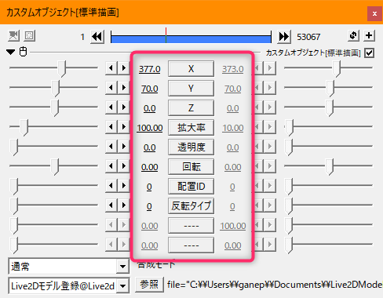
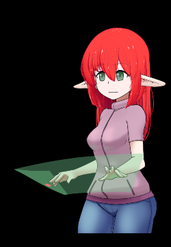
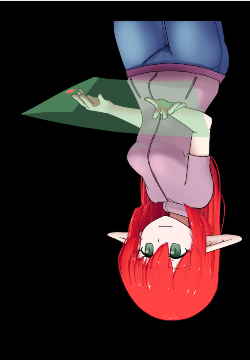

# モデルを読み込んで表示する

## ■配置とモーションコントロール

### ・Aviutlの拡張編集レイヤーの特性

Aviutlの拡張編集は上の番号が若いレイヤーから計算されて 
下のレイヤーが表示では上に重ねられていく形で処理されます。 
この仕組みに則ってLive2D Drawer for aviutlは動作します。

 

### ・レイヤーへの配置

|番号|説明|
|--|--|
|１|モーションの指示や描画よりも 番号が若いレイヤーにモデル配置を設置します。|
|２|モーションの指示はモデル設置よりも下で、 描画よりも上のレイヤーに設置します。
|３|描画は常に下のレイヤーに設置します。 このレイヤーに描画されます。|

 

### ・複数モデルの表示と配置ID

モデル登録の際に指定する **「配置ID」** でモーション指示のコントロールと読み込み制御をします。 
モデルを複数表示する場合はこの **「配置ID」** をかぶらないように指定する必要があります。 
もし同じ配置IDを２回指定した場合は後に指定されたほうが優先されます。 
また、配置IDの取り合いをした場合は毎フレームモデルの読み込みが発生します。

モデルの表示が重なった場合は、配置IDが大きい方が手前に表示されます。

 

モデル登録を行ったレイヤから描画のカスタムオブジェクトまでに置かれているモーション指定が解決された状態が 
描画のカスタムオブジェクトで描画されます。

### ・表示の切り替え

モデルの読み込みのタイミングは描画の際にチェックされ、 
読み込みが行われる条件は以下の２つになります。
* 前の描画の際に未指定だった配置IDに指定があった。
* 前の描画の際と違うファイルが配置IDに指定があった。

頻繁にモデルを入れ替える編集を行うとロードが多発し再生や書き出し、編集作業が重たいという現象につながるので、 
描画に対してのマスクなどを利用して表示だけ消す形にすると速度が安定します。

 

## ■配置での操作要素

|表示名|動作|説明|
|--|--|--|
|X|～|モデルの位置を描画のピクセルサイズに合わせて横方向に変更します。 時間軸に対しての変更が可能です。|
|Y|～|モデルの位置を描画のピクセルサイズに合わせて縦方向に変更します。 時間軸に対しての変更が可能です。|
|Z|×|影響しません。|
|拡大率|～|モデルのサイズを変更します。 時間軸に対しての変更が可能です。|
|透明度|×|影響しません。|
|回転|×|影響しません。|
|配置ID|ー|モーションの適用やロード管理に利用します。 動的な変化が怒らないようにしてください。|
|反転タイプ|ー|モデル表示の反転方法をしています。 動的な変化が怒らないようにしてください。|

### ・反転タイプ

|番号|挙動|サンプル|
|--|--|--|
|0|反転なし||
|1|Y軸で反転||
|2|X軸で反転||
|3|Y軸とX軸で反転||

# モデルを動かす

## ■パラメータ変化を指定する

パラメータの変化は対応するカスタムオブジェクトやアニメーション効果で変化を与えます。 
これらが変化を与える際に配置IDは対象とするモデルの配置の際に使用したIDと同一のものを指定する必要があります。

標準で用意されているパラメータを変化させるカスタムオブジェクト、アニメーション効果は以下のようなものがあります。 
<!-- 詳しい挙動に関しては別ページを確認してください。 -->

|名称|区分|効果|
|--|--|--|
|音声連動|カスタムオブジェクト|指定した音声ファイルとリップシンク指定のパラメータが連動します|
|まばたき|カスタムオブジェクト|まばたき指定のパラメータがまばたきの演算によってうごきます。|
|呼吸|カスタムオブジェクト|呼吸動作のパラメータが付与されます。|
|モーション(コード)|カスタムオブジェクト|モデルに登録されたモーションを再生します。|
|モーション(ファイル)|カスタムオブジェクト|モーションファイルを指定して再生します。|
|ノードモーション|カスタムオブジェクト|モデルに登録されたモーションから遷移番号で再生します。|
|表情(コード)|カスタムオブジェクト|モデルに登録された表情を再生します。|
|表情(ナンバー)|カスタムオブジェクト|モデルに登録された表情を番号指定で再生します。|
|スクリプトXYZ操作|アニメーション効果|付与されたオブジェクトのXYZ位置からスクリプトでパラメータの指定を行います。|

## ■パラメータ変化を置くレイヤー

パラメータ変化のカスタムオブジェクトやアニメーション効果は、 
* 指定する配置IDを持つモデル配置より下のレイヤー
* 描画のカスタムオブジェクトよりも上のレイヤー

以上の２点を満たす必要があります。

## ■パラメータ変化の重なりはレイヤ順

Live2D Drawer for aviutlでは複数のパラメータ変化レイヤーを重ねることができます。 
重ね方の制限は一切なく、複数のモーションや複数の表情を一度に重ねることも可能です。 
重なった際の適用順序はレイヤー処理の順序に対応し、上から順に適用されていきます。

単一のパラメータに複数の操作を重ねる場合、その操作が加算、乗算、上書きのどれであるかで結果が大きく変わります。

<!-- 加算乗算の言及と各オブジェクトで使用される演算 -->

パラメータ変化が適用されない状況ではデフォルトパラメータに毎フレームリセットされます。

# 描画オブジェクト

## Live2D描画

空のバッファにLive2Dモデルを描画します。 
透明なバッファに一旦描画する構造のため、 
背景に加算乗算するArtMeshが存在するモデルの場合は描画が乱れる場合があります。

## Live2D取り込み描画

表示されているバッファを取得し、このバッファに対して追加で描画します。 
背景に対して加算乗算するArtMeshが存在するモデルに対して有効です。 
ただし、バッファサイズの指定が画面のサイズを超えると動作しなくなる問題があるので注意してください。

# 物理演算

物理演算は描画に指定される現在時間の差分によって計算が進められ、 
逆行した場合は設定がリセットされるようになっっています。 
Live2Dの物理演算は動作FPSで挙動が変わる特性がありますが、 
物理演算設定ファイルにFPS情報が記録されている場合は保存されているFPSで動作します。 
物理演算設定ファイルにFPS情報の記録がない場合はAviutl側のFPSに準じて適用されます。