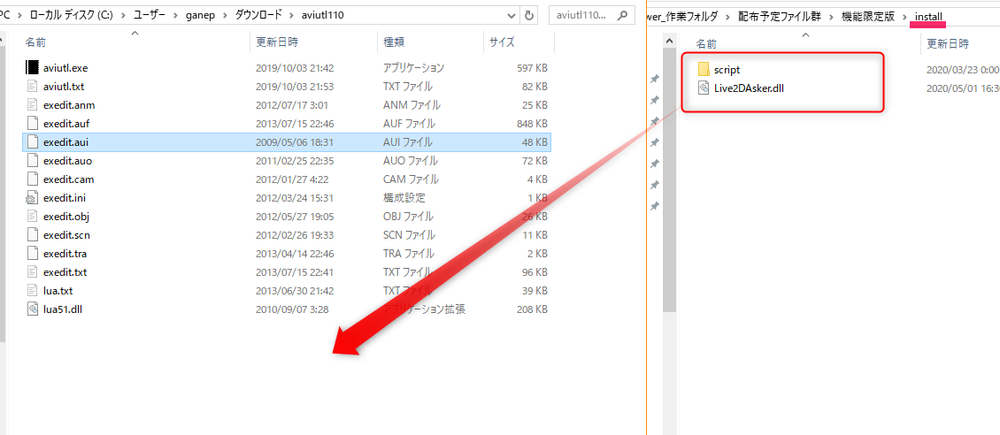
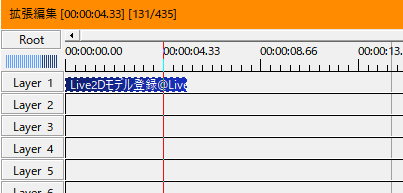
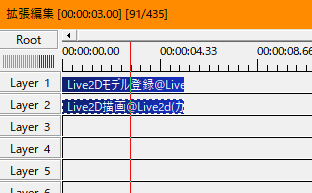
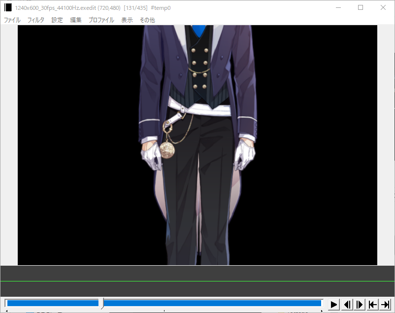

# Live2D Drawer for Aviutl とは？

Live2D Drawer for Aviutl とは動画編集ソフトAvitulでLive2D Cubismの組み込みファイル群を読み込んでタイムライン上で操作、レンダリングができるAviutl向けのプラグインです。

 

## ・Aviutlって？

動画編集、合成圧縮が可能なフリーソフトです。

詳しくは以下のAviutl公式のHPを確認してください。

[AviUtlのお部屋](http://spring-fragrance.mints.ne.jp/aviutl/)

 

## ・Live2Dって？

一枚絵から立体的に動かすことを主眼においたソフトです。

Live2Dに関しては以下のLive2D Cubism公式のHPを確認してください。

[Live2D Cubism](https://www.live2d.com/)

 

## ・Live2Dの組み込みファイル群って何を指すの？

.moc,.moc3ファイル、テクスチャのpngファイル、各種設定の入ったjsonファイル

各ファイルの関係をまとめたmodel.jsonまたはmodel3.jsonファイル。

上記をまとめて組み込みファイル群と称します。

 

# Live2D Drawer for Aviutl を使用するメリット

通常の動画制作フローでは動画への組み込みに連番画像ファイルを使用し、

モーションに修正があれば何度も動画の書き出しが必要になります。

<!-- TODO あとでイメージ図を足す。 -->

本プラグインを使用した場合、再生ごとに映像が新たにレンダリングされるため、

モーションの修正後でも連番書き出しなしに動画出力が可能になります。

また操作の影響を直接見ながら操作できるので確認サイクルが高速に行えます。

<!-- TODO あとでイメージ図を足す。 -->

 

# ダウンロード

配布は支援サイト経由で行われています。

登録だけで使用できる一般版と支援者向けのフル機能版があります。

|支援サイト|一般版|支援者向け版|
|---|---|---|
|Fantia|[一般版](https://fantia.jp/products/34178)|[支援者向け](https://fantia.jp/products/34177)|
|Enty|[一般版](https://enty.jp/posts/114870)|[支援者向け](https://enty.jp/posts/114869)|

<!-- 支援者向け版で使用できる機能の違いについての記述をする。APIとスクリプト両方で -->

 

# インストール

Aviutlがインストールされているフォルダ内の「exedit.aui」があるフォルダに「install」フォルダ内のファイルをコピーします。

Aviutl自体がインストールされている場所ではないことをに注意してください。

 

## ・インストールの確認

### プログラムの接続の確認

「接続確認＠Live2D」または「接続確認＠Live2DAdv」のカスタムオブジェクトを編集レイヤに配置し、

タイムラインをカスタムオブジェクトがある時間へ設定します。

正しく接続されていれば「正常に連携されています。」と表示されます。

 

### 描画の確認

①[Live2D公式のサンプルデータ](https://www.live2d.com/download/sample-data/)からサンプルモデルの名執をダウンロードします。

②レイヤ１に「Live2Dモデル登録」を設置します。

③「Live2Dモデル登録」のファイル指定に先程のサンプルモデルのzipから展開した

「natori_pro_jp\runtime\natori_pro_t04.model3.json」を指定します。

④レイヤ２に「Live2D描画」を設置します。

⑤名執のモデルが表示されれば機能していることが確認できます。

 
 
 

# 更新情報

★付きは支援者向けのみの内容

<!-- 各ファイルに記述される更新履歴を廃止してVersion情報だけにする。
こちらを参照するようにする。 -->

|日付|version||内容|
|---|---|---|---|
|2020/05/01|4.02|　|スクリプトに接続状況を確認するスクリプトが追加されました。|
||4.02|★|バイナリデータから値型に変換する命令が追加されました。|
||4.02|★|実験的にバイナリ方式のモーションファイルを読み込んで適用するスクリプトが追加されました。|
|2020/03/25|4.01|　|モデル登録で適用される位置情報がAviutlの座標と一致するように修正|
||4.01|★|Cubism3,4系でgetPolyPointやgetPolyRectで取得できる位置情報にズレが合った問題を修正|
|2019/09/04|4.00|　|Cubism4のメジャーアップデートに合わせてマスクの反転に対応。|
||4.00|★|getMaskingBufferのAPIを追加|
||4.00|　|背景へ加算乗算を行うためのgetOverWriteBufferのAPIを追加|
|2018/12/22|2.03|　|Cubism3.3のワープデフォーマの品質改善されたmoc3ファイルに対応|
||2.03|　|モデルの切り替えが起こるときにIDがかぶっていると開放しなかった問題を解消|
|2018/08/25|2.02|　|Cubism3側でクリティカルなエラーが起こったときにエラー情報が出力されない問題を修正|
|2018/08/18|2.01|　|Cubism3側でループパラメータが正しく動作するようになりました。|
||2.01|　|Cubism2側に不正なIDでSetParameterを行ったときにDrawerが落ちる問題を修正|
||2.01|　|改行の入ったUserDataが正しく読み込まれない問題を修正|
||2.01|　|非表示アートメッシュにUserDataによる着色が次回表示まで残る問題を修正|
|2018/07/26|2.00|　|Cubism3.2に対応|
|2017/11/01|1.05|　|callMotionで再生回数上限機能追加|
||1.05|　|callMotionでモーションのデータが帰ってくるように|
||1.05|　|setExpressionの計算方法を変更、最終で使用したタイミングで統合された表情モーションが適用に|
||1.05|★|APIの限定版との差別化に伴い、スクリプトを分離|
|2017/09/09|1.04|　|エラーログ機能追加|
|2017/07/20|1.03|　|物理演算のあらぶり抑制|
||1.03|　|表情APIの追加|
||1.03|　|表情、パラメーター、モーションで下のレイヤーが優先されるように|
||1.03|　|テクスチャが足らない時にエラー落ちしていたのを回避するように|
||1.03|　|一部スクリプトの追加|
|2017/06/21|1.02|　|バグフィクス|
|2017/06/12|1.01|★|バグフィクス|
|2017/06/00|1.00|　|公開開始|

 
