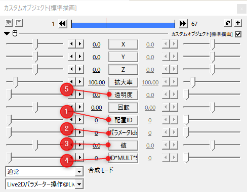
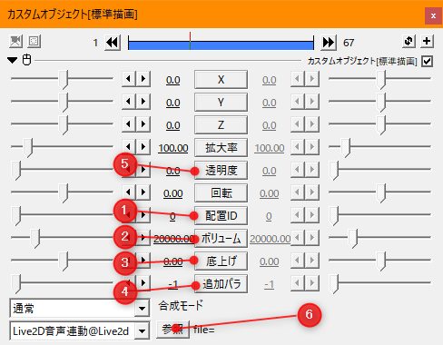
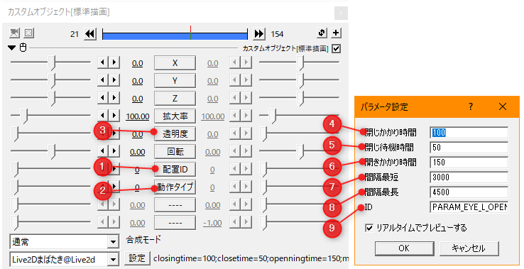
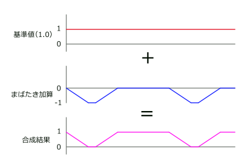
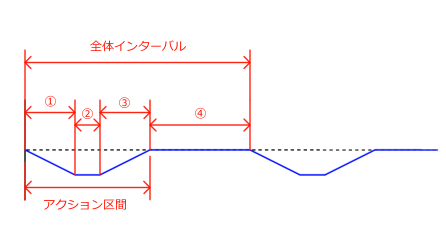
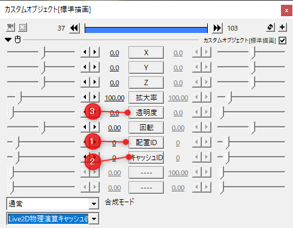

# 共通の設定

## 配置ID

複数のモデルが配置された中で個別にモデルの動きを指定するためにモデルIDを使用します。  
各モーション付けカスタムオブジェクト内の配置IDはLive2Dモデル配置で指定したIDと同じ番号を指定します。

詳しくは[マニュアルの基本動作](../basic/basic.md)を確認してください。

<br>
## 透明度による影響度指定

モーション付けカスタムオブジェクトの透明度要素はパラメータを付与する際の重み付けに使用されます。  
モーション付け前の値と、計算結果で付与された後の値との割合として影響を与えます。  
透明度をフェードアウトさせてポーズに乖離のあるモーション同士の接続をスムーズにしたり、  
同じ長さのモーション同士を融合するのに使用したりします。

```
「最終結果」=「処理前値」×「透明度％」+「計算結果」× （100％ - 「透明度％」）  
※透明度はパーセント解釈
```

<br>

## パラメータ付与の加算、乗算、設定モード

一部カスタムオブジェクトでは計算方法を加算、乗算、設定（上書き）から選択できます。  
またパラメータ計算は上のレイヤーから順番に行われるので、順番に合わせて設定する必要があります。

|種類|計算式|用途|
|--|--|--|
|加算|「計算結果」=「処理前値」+「指定値」|リップシンクなど|
|乗算|「計算結果」=「処理前値」×「指定値」|まばたきの大きさ変更|
|設定|「計算結果」=「指定値」|モーションの無視指定|

<br>

---

# パラメータ操作



|番号|要素名|説明|
|--|--|--|
|1|配置ID|パラメータを操作するモデルが配置されている番号を指定します|
|2|パラメータIndex|モデルに登録されている順のパラメータの指定を行います。<br>Cubism Viewer for OWで表示されるパラメータと同順です。|
|3|値|パラメータへ与える値を指定します。|
|4|値の設定方式の指定|パラメータ付与の加算、乗算、設定モード|
|5|透明度による比重設定|透明度による影響度指定|

<br>

---

# 音声連動



|番号|要素名|説明|
|--|--|--|
|1|配置ID|パラメータを操作するモデルが配置されている番号を指定します|
|2|ボリューム|音声からの入力に対してパラメータが1になる値の指定。<br>値が大きいほど反応が小さくなります。|
|3|底上げ|ボリュームで抑制したあとの0位置を指定するための調整値です。<br>無音レベルを指定することを想定しています。|
|4|追加パラメータIndex|後述するパラメータの指定方法以外に後付でパラメータを設定します。<br>Cubism Viewer for OWで表示されるパラメータと同順です。|
|5|透明度による比重設定|明度による影響度指定|
|6|音声ファイル指定|Aviutlで読み込める音声ファイルを指定します。|

## 音量計算式


```
「指定パラメータ」=「音声入力値」/「ボリューム」+「底上げ」
```

## 音声との連動


音声ファイルとモデルの音声連動をうまく連携させるには条件があります。  
1. 音声ファイルの再生速度が標準の100.0であること
1. 音声ファイルの再生開始位置と音声連動のカスタムオブジェクト開始位置が一致していること  
終了時間の一致は必須ではありません
1. 音声ファイルの再生で指定されるファイルと音声連動のカスタムオブジェクトで  
指定されるファイルが同一であること

## リップシンクのパラメータの指定方式

Cubism3以降ではリップシンクに関与するパラメータをモデラー側で指定する方式があり、  
本機能はこのパラメータ設定を参照しています。  
[Live2D公式マニュアル：BGMや音声を使用したシーンの作成](https://docs.live2d.com/cubism-editor-manual/generating-scene-from-audio-file/)

加えてCubism3より前の規格向けに「PARAM_MOUTH_OPEN_Y」に対して決め打ちでパラメータを指定しています。  
決め打ちパラメータとCubism3でのリップシンク指定が重複しても指定されるのは一回のみです。

音声のパラメータは0.0～1.0のスケールで作成されていることを前提としています。

<br>

---

# まばたき



|番号|要素名|説明|
|--|--|--|
|1|配置ID|パラメータを操作するモデルが配置されている番号を指定します|
|2|値の設定方式の指定|パラメータ付与の加算、乗算、設定モード|
|3|透明度による比重設定|明度による影響度指定|
|4|閉じかかり時間|瞼が閉じていくのにかかる時間|
|5|閉じ待機時間|完全につぶった状態が続く時間|
|6|開きかかり時間|瞼が開いていくのにかかる時間|
|7|間隔最短|インターバルの最短時間|
|8|間隔最長|インターバルの最長時間|
|9|ID|影響するパラメータへの直接指定|

## まばたきの値スケール



まばたきのパラメータは難解さを回避するために-1.0～0.0のスケールで加算を使用して運用されることを想定しています。  
目を大きく見開く機能のあるモデルで0.0～1.5スケールのモデルなどでは想定しない挙動を示すことがあります。  

## まばたきの時間設定の意味



|番号|要素名|説明|
|--|--|--|
|①|閉じかかり時間|瞼が閉じていく時間です。<br>パラメータは時間に対して直線的に変化します。|
|②|閉じ待機時間|瞼が完全に閉じている時間です。|
|③|開きかかり時間|瞼が開いていく時間です。<br>パラメータは時間に対して直線的に変化します。|
|④|区間|次のまばたきまでの待機時間です。<br>最短と最長の間でランダムに変化します。|
||アクション区間|①、②、③を合算したまばたき動作にかかる時間です。<br>この時間は設定によって固定されます。|
||全体インターバル|1サイクルの時間です。区間の設定により変動します。|

## まばたきのパラメータの指定方式

音声連動で使用されるリップシンクパラメータと同じく、Cubism3以降ではまばたきのパラメータをモデラーで指定できます。  
[Live2D公式マニュアル：まばたき設定](https://docs.live2d.com/cubism-editor-manual/eye-blink-settings/)
この他に9番のIDで指定するパラメータでも動作を指定することができます。  
2つの指定が重なったときでもパラメータの付与動作は一回だけ行われます。

<br>

---

# 呼吸


|番号|要素名|説明|
|--|--|--|
|1|配置ID|パラメータを操作するモデルが配置されている番号を指定します|
|2|値の設定方式の指定|パラメータ付与の加算、乗算、設定モード|
|3|追加パラメータ|IDの直接指定以外で登録順のパラメータで簡易登録を行います。|
|4|透明度による比重設定|明度による影響度指定|
|5|吸い込み|パラメータが0.0から1.0へ上がっていく動作の時間です。|
|6|吸い込み待機|パラメータが1.0で待機する時間です。|
|7|吐き出し|パラメータが1.0から0.0へ下がっていく動作の時間です。|
|8|吐き出し待機|パラメータが0.0で待機する時間です。|
|9|ID|影響するパラメータへの直接指定|

<br>

---

# モーションファイル

## コード指定


|番号|要素名|説明|
|--|--|--|
|1|配置ID|パラメータを操作するモデルが配置されている番号を指定します|
|2|コールナンバー|登録モーションが複数あるときに登録順番で指定します|
|3|動作タイプ|モーションのループのタイプを指定します。<br>0：1回のみ再生<br>2：ループ再生|
|4|再生速度|モーションの再生速度をパーセント解釈で指定します。|
|5|透明度による比重設定|明度による影響度指定|
|6|モーションコード|モデルファイル内部で登録されているグループ名を指定します。|

※ モーションのパラメータ付与タイプは設定のみです。

### モデルへのモーション登録

モーション(コード)を使用するには事前にmodel3.jsonへのモーション登録をしておく必要があります。  
モーションの登録はCubism Viewer for OWで行うか、直接model3.jsonを編集する必要があります。


Cubism Viewer for OWで登録を行う場合はグループ名で指定を行います。  
1つのグループに複数のモーションを登録する場合、順番を制御することができないことに注意してください。

<br>


jsonで編集する場合、Motionの登録エリアにグループごとにモーションを記述していきます。

<br>

## ファイル指定


|番号|要素名|説明|
|--|--|--|
|1|配置ID|パラメータを操作するモデルが配置されている番号を指定します|
|2|動作タイプ|モーションのループのタイプを指定します。<br>0：1回のみ再生<br>2：ループ再生|
|3|再生速度|モーションの再生速度をパーセント解釈で指定します。|
|4|再生位置|モーションの再生開始位置を秒で指定します。|
|5|透明度による比重設定|明度による影響度指定|
|6|モーションファイル|再生するモーションファイルを指定します。<br>このファイルはモデルに登録する必要はありません。|

<br>

---

# ノードモーション

## 状態遷移という考え方


動画内で特定のポーズを維持したいと考えたときにポーズを状態として考えると、  
各ポーズ間の変化を状態遷移として考えることができます。  
状態遷移図にすると矢印にある部分のモーションを用意する必要があることがわかるかと思います。

この状態遷移を表に落とし込むと更に性質がわかりやすくなります。


状態が3つあるときに遷移は３の自乗で9つの遷移が必要となります。  
全体の遷移数が固定されると遷移の前と後の状態を指定することで  
モーションの番号が特定できることができるようになります。

ノードモーションではこの前と後の状態を指定して遷移モーションを再生し、  
その後安定状態のモーションを永続的に再生することで  
状態遷移型のモーション再生を少ないカスタムオブジェクトの操作量で実現するための機能となります。

```
前状態が２の腕組み、後状態が３の腰手の状態と指定したとき、  
２→３の７番の遷移モーションが再生され、７番モーションが再生仕切ったあとは  
永続的に８番のモーションが再生されます。
```

<br>

## モーションの準備

まずポーズの数を決めます。ポーズの個数をN個として１つのノードセットのモーション数はN×N個必要になります。
特定の遷移を使用しない想定でもモーションファイル自体は必要になります。

モーションの並びは前の状態ごとに後の状態が並んでいく形になります。


model3.jsonへモーションファイルの登録は上記の順番を守って入力するひつようがあります。

```
"Motions": {
    "Arm": [
        {
            "File": "motions/arm1-1.motion3.json"
        },
        {
            "File": "motions/arm1-2.motion3.json"
        },
        {
            "File": "motions/arm1-3.motion3.json"
        },
        {
            "File": "motions/arm2-1.motion3.json"
        },
        {
            "File": "motions/arm2-2.motion3.json"
        },
        {
            "File": "motions/arm2-3.motion3.json"
        },
        {
            "File": "motions/arm3-1.motion3.json"
        },
        {
            "File": "motions/arm3-2.motion3.json"
        },
        {
            "File": "motions/arm3-3.motion3.json"
        }
    ]
}
```

## ノードモーションの使用方法


|番号|要素名|説明|
|--|--|--|
|1|配置ID|パラメータを操作するモデルが配置されている番号を指定します|
|2|前ノード|遷移前の状態を指定します。<br>通常前のカスタムオブジェクトで指定される3番の値を入れます。|
|3|今ノード|現在のカスタムオブジェクトが到達すべき状態|
|4|再生速度|モーションの再生速度をパーセント解釈で指定します。|
|**5**|**透明度による比重設定**|**明度による影響度指定。<br>機能はしますが、2つのモーションが走る仕様のため使用しないでください。**|
|6|モーションコード|モデルに登録されているモーショングループのIDを指定してください。|
|7|ノード最大値|状態の数　N　を入力してください。|

**※ダイアログにある前ノードモーションの項目は使用しないように注意してください。**

<br>


配置は連続して敷き詰めて置くようにします。  
同一のレイヤーに入れる必要はありませんが、同一レイヤーにおいておくと隙間なく敷き詰める編集と  
同一グループの管理がしやすくなります。

<br>

## TIPS

### ノードモーションは部位ごとに分離可能

ノードモーションの総モーション数は指数的に増えるので、  
腕の状態が３，胴体の状態が３でもすべての状態を作ると総数は３ｘ３の自乗で８１パターンになります。  
これを腕だけのノードモーションと胴体だけのノードモーションに分離すると３の自乗づつで１８パターンに減ります。
この２つのノードモーションを同時に使用すればモーションの自由度があがります。
遷移のタイミングをずらせるのも利点です。

### すべてのノード間を補完しなくても良い

すべてのノード間のきれいなモーションを作成せずとも、  
使ってはならない組み合わせであることがわかるモーションをいれて通行止めにすることで、  
実作業量をへらすことができます。

### 同じ部位でも２つのグループに分けられる

同一部位のノードが増えすぎても共通のポーズ１つある互いのグループへ遷移しない２つのグループに分ければ  
全体の遷移数をへらすことができます。

```
９ｘ９　＞　５ｘ５＋５ｘ５

８１　＞　５０
```

<br>

---

# 表情

## コード指定


|番号|要素名|説明|
|--|--|--|
|1|配置ID|パラメータを操作するモデルが配置されている番号を指定します|
|2|透明度による比重設定|明度による影響度指定|
|3|表情ID|Expressionとして登録されているIDを利用する。|

### 表情IDの指定方法


model3.jsonに記述されるNameを使用して指定します。  
Jsonに表記されるNameとLive2D Cubism Viewer for OWで表示される文字列が  
異なることがあるので注意してください。

## ナンバー指定


|番号|要素名|説明|
|--|--|--|
|1|配置ID|パラメータを操作するモデルが配置されている番号を指定します|
|2|前状態の表情ナンバー|後述の方法で指定される番号<br>適用度が100％から0％へ直線的に減る。|
|3|後状態の表情ナンバー|後述の方法で指定される番号<br>適用度が0％から100％へ直線的に増える。|
|**4**|**透明度による比重設定**|**明度による影響度指定。<br>機能はしますが、2つの表情が走る仕様のため使用しないでください。**|

前表情から後表情へ直線的に表情が切り替わります。
細かい表情変化に使用します。

### expression3.jsonの用意


名前を番号にし、番号を文字列に変換することで簡易的な操作を可能にします。

---

# 物理演算

物理演算キャッシュが指定されていない場合は描画のタイミングで自動的に適用されます。<br>
物理演算キャッシュが存在している場合、物理演算キャッシュが存在するレイヤーのステップで物理演算が適用されます。<br>
キャッシュが適用されたモデルには描画時の物理演算は適用されなくなります。

## ★物理演算キャッシュ



|番号|要素名|説明|
|--|--|--|
|1|配置ID|物理演算キャッシュを設定するモデルが配置されている番号を指定します|
|2|キャッシュID|物理演算キャッシュを特定するIDを指定します。<br>キャッシュIDはタイムライン全体でユニークである必要があります。|
|3|透明度|物理演算の適用割合を指定します。|

<br>

## ★物理演算キャッシュ表示


|番号|要素名|説明|
|--|--|--|
|1|配置ID|物理演算キャッシュを設定するモデルが配置されている番号を指定します|
|2|キャッシュID|物理演算キャッシュを特定するIDを指定します。<br>キャッシュIDはタイムライン全体でユニークである必要があります。|
|3|表示サイズ|物理演算キャッシュを表示するバーの横幅を指定します。|

### 再生画面上の表示

※このキャッシュ表示は出力動作中には非表示となります。

* 信頼状態の表記状態<br>
① 明るい緑色が表示されている場合、<br>
再生している現在フレームの表示が物理演算が正しく積み重ねられた計算が適用されてる状態を示しています。<br>
緑色のバーは計算が信頼されている領域を示しています。<br>
入力パラメータが一致されている場合は前回計算した値を信頼する動作になります。<br>
② 現在地点は白い線で表示されます。<br>
③ 赤黒い領域は計算状態が確定していない領域を示しています。<br>


* 非信頼状態の表記<br>
暗い緑色が表示されている場合、<br>
再生している現在フレームの表示が信頼できず、物理演算が適用されていない状態を示しています。<br>
明るい緑色に変わるまで再生位置を戻して確認する必要があります。<br>
