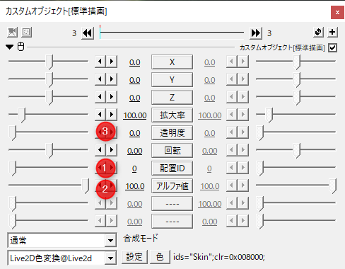
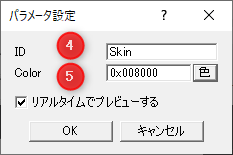
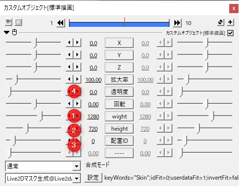
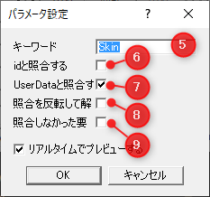

# 特殊効果について

Live2D Drawer for Aviutl では描画するArtMeshに対して追加の描画効果を指定できます。 
指定ではArtMesh単位で行う場合と、ユーザーデータで指定する2つの方法が指定できます。

## 基礎となるユーザーデータ

Live2D Drawer for Aviutl ではArtMeshに付与されるユーザデータを利用した指定方法を利用できます。 
改行で区切られた文字列で認識します。

https://docs.live2d.com/cubism-editor-manual/userdata/

# コマンド

## 色変換

|番号|要素名|説明|
|--|--|--|
|1|配置ID|パラメータを操作するモデルが配置されている番号を指定します|
|2|上書きアルファ値|ArtMeshの描画のアルファ値を上書きする値を指定します。|
|3|透明度|色の適用の割合に影響する。|

|番号|要素名|説明|
|--|--|--|
|4|ID|UserDataに含まれるIDで指定されます。|
|5|Color|描画に乗算される色を指定します。|

## マスク生成 

※このオブジェクトは描画のあとに使用するようにしてください。

|番号|要素名|説明|
|--|--|--|
|1|Width|用意されるマスク画像の画像バッファの幅のサイズを指定します。|
|2|Height||
|3|配置ID|モデルが配置されている番号を指定します|
|4|透明度|マスクの不透明度を指定します。|

|番号|要素名|説明|
|--|--|--|
|5|キーワード|対象指定用の文字列を入れます。|
|6|idと照合する|チェックが入っているとき、ArtMeshのID名とキーワードが一致するときにマスクが描画されます。|
|7|UserDataと照合する|チェックが入っているとき、UserDataのIDの一つとキーワードが一致するときにマスクが描画されます。|
|8|照合を反転して解釈する|上記条件を反転して解釈します。|
|9|照合しなかった要素は描画をスキップする|対象外のArtMeshが上に被さらないようにマスクを描画します。|