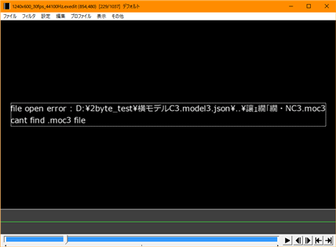

# トラブルシューティング

## ■前提として

「接続確認」のカスタムオブジェクトを使用して正しくインストールがされていることを確認してください。

[プログラムの接続の確認](../intro.md#プログラムの接続の確認)

もし接続確認の段階で正常でない場合は、ファイルをインストールする位置の確認と  
セキュリティソフトが動作を阻害していないか確認してください。

### ・「Lua拡張命令がみつかりません」と表示される

Luaスクリプトからレンダリング機構へアクセスするためのdllファイルが見つからない状態です。  
以下の状態であると考えられます。

* 「Live2DAsker.dll」ファイルの置く位置が間違っている。  
* セキュリティソフトがDLLへのアクセスを妨害している。
* ダウンロードファイルのブロック機能が解除されていない [解除方法](https://www.atmarkit.co.jp/ait/articles/1603/11/news050.html)。
* DLLの実行に必要な[Microsoft Visual C++ 2012 再頒布可能パッケージ](https://www.microsoft.com/ja-JP/download/details.aspx?id=30679)がインストールされていない。

### ・「描画ユニットが起動できていません」と表示される

Lua拡張命令から実際に描画を行うソフトの起動や通信がうまく行っていない状態です。  
以下の状態であると考えられます。

* スクリプトフォルダに「Live2DDrawer.exe」を置いていないのでDLLから起動ができていない。
* セキュリティソフトがDLLへのアクセスを妨害している。
* ダウンロードファイルのブロック機能が解除されていない [解除方法](https://www.atmarkit.co.jp/ait/articles/1603/11/news050.html)。
* [DirectX](https://www.microsoft.com/ja-jp/download/details.aspx?id=34429)がインストールされていない。  
* DLLの実行に必要な[Microsoft Visual C++ 2015 再頒布可能パッケージ](https://www.microsoft.com/ja-JP/download/details.aspx?id=52685)がインストールされていない。

## ■モデルが表示されない

### ・描画の代わりに文字化けしたパスが表示されるケース

model3.json内部で2byte文字を使用すると変換が正しく行われず読み込みに失敗します。  
Live2D Cubismからの書き出し時に半角英数字のみ使用することで回避できます。

### ・何も表示されない

#### 原因１：ファイルを間違えている

.moc3ファイルをモデル登録で使用するとエラー表示なしになります。  
モデル登録では.model3.jsonを指定してください。

#### 原因２：モデルの表示が設定的に消えている

Partの書き出し時にモデラー上で非表示状態で書き出されたときに、  
Partの初期値が非表示で固定されます。  
この状態でDrawerへ読み込むと初期値をそのまま読み込むため表示が消えたい状態になります。  
パーツへの単独操作は行えないので、表情設定などでパーツの表示状態を切り替えて対応してください。

Live2D Viewer for OWでmodel3.jsonを確認することで  
内部の状態がどの様になっているか、確認することができます。

#### 原因３：モデルの書き出し時に全体が対象外になっている

Live2D Cubismでは組み込みファイル書き出しの際にモデラーで非表示状態のオブジェクトが  
書き出しされない設定が存在します。  
この状態ではPartの表示状態を操作しても表示されません。

こちらもLive2D Viewer for OWでmodel3.jsonを確認することで  
内部の状態がどの様になっているか、確認することができます。

## ■モデルの描画の一部が欠ける

なにも表示されないの原因２，原因３と同様のケースだとおもわれます。

## ■正しく発色しない

### ・透明色エリアに対する加算がある。

透明色エリアはLive2Dモデルで背景を完全にArtMeshで上書きを行わない描画上の範囲を指します。  
この透明色エリアに対して加算、乗算操作を行うと、一度プリマルチプライドカラーで取り扱われる透明バッファからAviutl上の処理で処理するためストレートアルファに変換され、  
その際の計算が原因で発色が変化します。

回避方法としてプリマルチプライドカラーのまま取り扱う方法と、  
Aviutl上のレンダーバッファを下地にして描画する方法があります。

#### プリマルチプライドカラーで取り扱う。

Live2D描画の混色方法の項目を１に変更するとプリマルチプライドカラーのままAviutlのバッファに書き込まれます。  
この際、半透明部分は黒ずむ傾向にあることに注意してください。  

#### Live2D描画前のバッファ内容を下地に描画を行う。

「Live2D取り込み描画」を使用するとレンダリング寸前のAvitulのバッファを下地にして描画されます。  
下地に透明度０のバッファを使用するようになるため通常なら反映できない背景への加算、乗算などの処理もきれいに発色します。  
Aviutl側のバッファの取り込みがうまく行かないケースがあり描画自体が動作しないケースが確認されており、必ずこの手法が有効かどうかは保証されません。  

#### まとめ

|ストレートカラー|プリマルチプライドカラー|取り込み描画|
|--|--|--|
||||
|透明領域に対して加算があると色合いが崩れる|透明領域に対して加算があっても色合いは安定。 透明領域が暗くなる傾向がある。|加算も乗算もきれいに発色する。 ただし、透明領域がなくなるためエフェクトが画面全体に適用されるようになる。|
