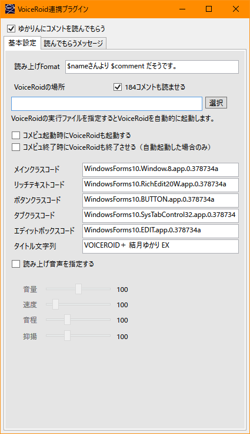

# 概要

https://ryu-s.github.io/app/multicommentviewer

上記で公開されているMultiCommentViewerでボイスロイドを直接操作して読み上げを行うプラグインです。

上記公開に含まれる棒読みちゃんプラグインをベースに作成されています。

# インストール

* 「copythis」フォルダの中身をマルチコメントビューアのフォルダへコピーする。

インストールが成功していれば以下の画像のようにプラグインのリストに「VoiceRoid連携」の項目が追加されます。

# 基本的な設定方法

|項目|説明|
|--|--|
|ゆかりんにコメントを読んでもらう|チェックが入ることでコメント読み上げが動作するようになります。 実行体やタイトル文字列を調整することでゆかりさん以外でも動作します。|
|読み上げFormat|コメントを読み上げるときの文章を構成します。 $nameはコメント者の名前に、$commentはコメント内容に変換されます。|
|VoiceRoidの場所|ボイスロイドの実行体（VOICEROID.exe）を指定します。 このファイル指定で特定しているわけでなく、下記にある起動のための情報です。|
|コメビュ起動時にVoiceRoidも起動する|コメントビューア起動時にVoiceRoidの場所で指定した実行体を起動するようにします。|
|コメビュ終了時にVoiceRoidも終了させる|連動して終了するようにします。|
|～～コード|制御用のFormクラスを指定するのに使用します。 動作がおかしいときにspy++などで調査して更新します。 わからないときは触れないようにしてください。|
|タイトル文字列|VoiceRoidを特定するのに使用するタイトルの文字列です。 ゆかりさん以外を使用する場合、ここを書き換えてしようしてください。|
|読み上げ音声を指定する|読み上げ設定をプラグイン側で指定できるようになります。|

本家の棒読みちゃんプラグインと同様の構造になっています。

# 更新履歴

|日付|version|内容|ダウンロードリンク|
|:--:|:--:|--|--|
|2020-04-12|0.1|公開開始|[MCV-VoiceRoidPlugin_20200412.zip](https://ganeesya.github.io/SupportPage/dl/mcv_voiceroid_plugin/VoiceRoidPlugin_20200412.zip)|

# ソースコード

https://github.com/Ganeesya/MultiCommentViewer

上記のGitHubで公開されています。

# ライセンス

このソフトウェアは下記のリポジトリから派生され、

https://github.com/CommentViewerCollection/MultiCommentViewer

GPL-v3によって公開されています。

ライセンス全文はzip内部かソースコードのリポジトリに掲載。